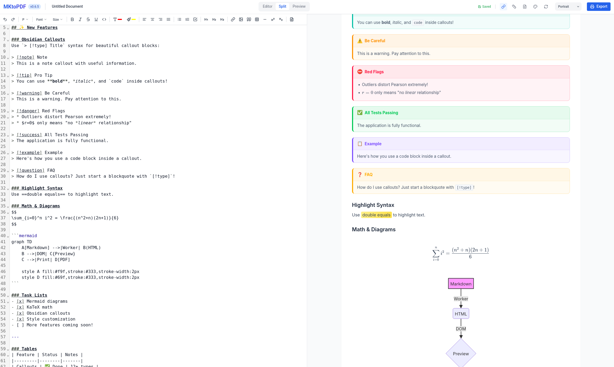

# MKtoPDF

[](https://mktopdf.pro-grammer.de/)

MKtoPDF is a high-performance, privacy-focused Markdown editor and PDF export engine. It leverages modern web technologies to provide a seamless writing experience with powerful features like LaTeX math rendering and Mermaid diagrams, all while keeping your data entirely local.



## Key Features **([Demo](https://mktopdf.pro-grammer.de/))**

-   **🚀 High Performance**: Powered by a Web Worker to ensure the UI remains smooth even with large documents.
-   **🔐 Privacy Centered**: No data ever leaves your machine. All processing happens locally in your browser.
-   **📑 Professional PDF Export**: Real-time print preview and high-quality PDF generation using Paged.js.
-   **📐 Math & Diagrams**: Native support for **LaTeX** (via KaTeX) and **Mermaid.js** diagrams.
-   **💾 Auto-Save**: Persistent draft buffer using LocalStorage so you never lose your progress.
-   **🌐 Offline Ready**: Completely self-contained. No external CDNs required for core functionality.
-   **🎨 Robust Styling**: Modern, clean UI built with Tailwind CSS.

## Getting Started

### Prerequisites

-   [Node.js](https://nodejs.org/) (Latest LTS recommended)
-   [pnpm](https://pnpm.io/) (`npm install -g pnpm`)

### Installation

1.  **Clone the repository**:
    ```bash
    git clone https://github.com/AlexsdeG/MKtoPDF.git
    cd MKtoPDF
    ```

2.  **Install dependencies**:
    ```bash
    pnpm install
    ```

3.  **Setup Static Assets (KaTeX)**:
    To enable offline math rendering, you must copy the KaTeX distribution files into the `public` directory:
    ```bash
    mkdir -p public
    cp -r node_modules/katex/dist/* public/
    ```

### Development

Start the development server:
```bash
pnpm dev
```

### Build

Create a production-ready bundle:
```bash
pnpm build
```

The output will be in the `dist` directory.

### Testing

Run the test suite with Vitest:
```bash
pnpm test
```

## Technical Stack

-   **Frontend**: React + Vite
-   **Editor**: CodeMirror 6
-   **Markdown Engine**: Unified (remark/rehype)
-   **Styling**: Tailwind CSS
-   **PDF Layout**: Paged.js
-   **Math**: KaTeX
-   **Diagrams**: Mermaid.js
-   **Concurrency**: Web Workers for background processing

## License

MIT - See [LICENSE](LICENSE) for details.
